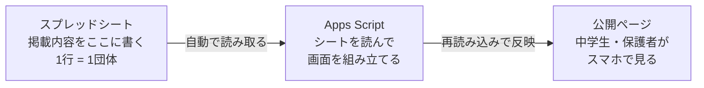

# おのみち部活さがし 引き継ぎ資料

2026-09-30 作成

この資料は、システム開発の経験がない方が、このシステムを引き継いで運用できるように書いたものです。専門用語はできるだけ使わず、使う場合はその場で説明しています。

> 編集可能な版（コメントもできます）: https://claude.ai/code/artifact/f6aefcd4-1a07-42d6-9778-ff1159cab776

## このシステムは何か

尾道市の中学生向けに、学校の外で参加できるクラブやイベントを、スマホで探せるようにした WEB ページです。

仕組みは、あなたが**スプレッドシートに書いたことが、そのままページに出る**というだけです。



あなたの仕事は左端のマス目を埋めることだけです。真ん中は勝手に動きます。

この資料の大半は、左端の「スプレッドシートに書く」の説明です。真ん中のプログラムは、故障しない限り触る必要がありません。

## 引き継ぐもの一覧

すべて Google アカウント **dsaito85a@gmail.com** の中にあります。このアカウントのログイン情報を受け取ることが、引き継ぎの第一歩です。

| 名前 | 何のためのもの | 場所 |
| --- | --- | --- |
| Google アカウント | 下の3つすべての持ち主。パスワードを引き継いでください | dsaito85a@gmail.com |
| スプレッドシート「おのみち部活さがし」 | 掲載内容そのもの。**日常的に触るのはここだけ** | [シートを開く](https://docs.google.com/spreadsheets/d/14qLYFRZ_aCKHl7a_Rf5Ky4ULqWtEu4L1EDuRrBOH0Dk/edit) |
| Apps Script「おのみち部活さがし」 | シートを読んで画面を作るプログラム。普段は触りません | [エディタを開く](https://script.google.com/d/1rRWxeqEs8ZzoOqnVXzLTRZyPBUzkaam8R3AUZ5txCRiKz75bmnoeH44d/edit) |
| 公開URL（ウェブアプリ） | 利用者が見るページ。この URL を配ります | [公開ページを開く](https://script.google.com/macros/s/AKfycbyMGMMw59yvpsAf01-SKy4_thHLWFPivV0xYk20bzsioV0xnSXXdyqlQ-nkbt-Py3YrPw/exec) |
| GitHub リポジトリ（非公開） | プログラムの控え。技術者に相談するときに渡します | [github.com/daisuke85a/onomichi-club](https://github.com/daisuke85a/onomichi-club) |

公開URLは長いので、配布するときは QR コードにするか、短縮URLを作ると案内しやすくなります。

**デプロイID**（技術者に伝える必要が出たときのための番号）：`AKfycbyMGMMw59yvpsAf01-SKy4_thHLWFPivV0xYk20bzsioV0xnSXXdyqlQ-nkbt-Py3YrPw`

## 掲載内容を更新する

普段の作業はこれだけです。**スプレッドシートを編集するだけ**で、WEBページに反映されます。プログラムを触る必要はありません。

### 新しいクラブ・イベントを追加する

1. スプレッドシートを開き、「クラブ一覧」シートを開く
2. 一番下の空いている行に、左から順に入力する
3. 一番左の「公開」列のチェックボックスに **必ずチェックを入れる**（これを忘れるとページに出ません）
4. 公開URLを開いて、ページを再読み込みすると追加されています

保存ボタンはありません。Google スプレッドシートは入力した瞬間に自動保存されます。

### 内容を直す

該当するマスをクリックして書き換えるだけです。月会費が変わった、連絡先が変わった、場所が変わった——すべてこれで対応できます。

### 掲載をやめる・一時的に隠す

行を削除せずに、**「公開」のチェックを外してください**。ページからは消えますが、データはシートに残ります。終わったイベントや、休止中のクラブに使えます。後で再開するときはチェックを戻すだけです。

行ごと削除すると元に戻せません（正確には Ctrl+Z や履歴から戻せますが、手間がかかります）。迷ったらチェックを外す方を選んでください。

### 反映のタイミング

シートを直したら、公開URLを**再読み込み**すればすぐに反映されます。利用者の画面にも、次に開いたときには新しい内容が出ます。

## 入力する14項目の意味

シートの1行目の見出しが、そのままページの表示項目になります。

| 列 | 入力するもの | 例・注意 |
| --- | --- | --- |
| 公開 | チェックボックス | チェックありでページに出る。**忘れやすいので注意** |
| 種別 | クラブ または イベント | プルダウンから選ぶ。ページ上部の切替ボタンに連動 |
| 種目 | 競技・活動の名前 | 「バスケットボール」。**表記を揃えること**（別表記は別のボタンになる） |
| 名称 | 団体名・イベント名 | カードの見出しになる |
| 参加対象 | 男子・女子 ／ 男子 ／ 女子 | プルダウンから選ぶ。絞り込みに使われる |
| 対象学年 | 自由入力 | 「中1〜中3」「小5〜中3」 |
| 費用 | 自由入力 | 「月3,000円」「無料（要申込）」。書いた文字がそのまま出る |
| 活動日 | クラブは頻度、イベントは日時 | 「週2日（火・木 19:00〜21:00）」 |
| 活動場所 | 場所の名前 | 「長江中学校 体育館」 |
| 校区 | 最寄りの中学校名 | プルダウンから選ぶ。**「全域」にするとどの校区で絞っても表示される** |
| 紹介 | 紹介文 | 「くわしく見る」を開いたときに出る。長さは2〜3文が読みやすい |
| 連絡先 | 担当者名・電話・メール | 団体の了承を得たものだけを載せる |
| URL | 公式サイト・申込ページ | 入れるとボタンが出る。無ければ空でよい |
| URLパスワード | 合言葉 | **入れるとその行のリンクが保護される。空欄なら誰でも見られる** |

空欄でもエラーにはなりません。その項目がカードに出ないか、「—」と表示されるだけです。

校区のプルダウンに無い中学校を追加したい場合は、そのマスに直接学校名を打てば入ります（警告が出ますが無視して問題ありません）。

### リンクにパスワードをかける

「URLパスワード」のマスに合言葉を入れると、その団体のリンクは**合言葉を入力した人にだけ**表示されます。会員だけに申込フォームを見せたいときなどに使えます。

- 空欄にしておけば、今まで通り誰でもリンクを開けます
- 合言葉はシートに書いたそのままの文字で判定します（大文字・小文字、全角・半角も区別します）
- 合言葉を変えたいときは、そのマスを書き換えるだけです
- 合言葉を消せば、保護が外れて誰でも見られるようになります

**この機能でできないこと**：合言葉を知った人がリンクを他の人に教えることは止められません。「関係者以外にうっかり見られない」ための仕組みであって、本当に秘密にすべき情報には使わないでください。

## 困ったときは

上から順に確かめてみてください。ほとんどは最初の2つで解決します。

| 症状 | まず確かめること |
| --- | --- |
| 追加したのにページに出ない | 「公開」のチェックが入っているか。その上でページを再読み込み |
| 直したのに古い内容のまま | ブラウザの再読み込み。それでも駄目なら一度タブを閉じて開き直す |
| 種目のボタンが二重に出る | 種目列の表記ゆれ（「サッカー」と「サッカー 」の空白など） |
| ページ全体が真っ白 | 数分おいて再読み込み。続くなら下の「最後の手段」へ |
| 「アクセスをリクエスト」と出る | 公開設定が変わっています。それ以上は触らずに相談してください |
| シートを誤って消した | Google スプレッドシートのメニュー「ファイル」→「変更履歴」から戻せます |

### 最後の手段：ページがどうしても表示されないとき

プログラムの方に問題が起きている可能性があります。この状態は **自分で直そうとせず**、資料の最後にある連絡先に相談してください。

連絡するときに、次の3つを伝えると早く解決します。

1. 何をしたときに起きたか（例：行を追加した直後）
2. 画面に出ている文言（スクリーンショットがあると確実）
3. 使った端末とブラウザ（iPhone の Safari、など）

## さわらないほうがいいもの

これらは壊れると復旧に時間がかかるものです。目にしてもそのままにしてください。

- **1行目の見出しを書き換えない**。見出しの文字とプログラムが紐づいています。「費用」を「料金」に直すだけでも、その列がページに出なくなります
- **列を追加・削除・並べ替えない**。項目を増やしたいときは相談してください
- **シート名「クラブ一覧」を変えない**
- **Apps Script のエディタを開いて編集しない**。見るだけなら安全ですが、保存するとページが止まることがあります
- **公開URLを再発行しない**。「新しいデプロイ」を作ると URL が変わり、配ったリンクが全部使えなくなります
- **Google アカウントを削除しない**。このアカウントが無くなるとシステム全体が消えます

逆に、**行の追加・修正・並べ替え、チェックの開閉は自由にやって問題ありません**。行の順番を入れ替えると、ページの表示順もその通りに変わります。

## 自動の見張り（ヘルスチェック）

毎日1回、システムが自分で「ページがちゃんと表示されるか」「データが読めるか」を確認し、**問題があればメールで知らせます**。Google 側の仕様変更などで突然動かなくなったとき、気づかずに放置するのを防ぐためのものです。

### 届くメールの種類

| 件名 | 意味 | すること |
| --- | --- | --- |
| 【要確認】…問題が出ています | ページかデータに異常。中身に何が壊れたか書いてあります | メールの内容を見て、直せなければ連絡先へ相談 |
| 【継続中】…問題が出ています | 直っていないまま24時間経過 | 同上。自分で直せない場合は早めに相談を |
| 【復旧】…正常に戻りました | 問題が解消した | 何もしなくて大丈夫 |
| …週次レポート（異常なし） | 毎週月曜の定期連絡 | 何もしなくて大丈夫 |

**週次レポートが届かなくなったら要注意です。** 見張りの仕組み自体が止まっている可能性があります。その場合は Apps Script エディタの左側「トリガー」を開いて、`healthCheck` が登録されているか確認してください。

### 知らせ先を変える・増やす

スプレッドシートの **「通知先」シート**で管理します。クラブ一覧と同じファイルの中にあるので、タブを切り替えるだけです。

| 列 | 入力するもの |
| --- | --- |
| 有効 | チェックボックス。外すとその人には送られません |
| メールアドレス | 1行に1つ。何人でも登録できます |
| 担当・備考 | メモ欄（誰のアドレスか分かるように） |

人を増やすときは行を足してチェックを入れるだけ、減らすときはチェックを外すだけです。行を消す必要はありません。

アドレスの書き間違いがあると、次回のチェックで「メールアドレスとして読めない行があります」と知らせが届きます。その人以外には正常に届くので、気づいたら直してください。

**誰も登録されていない状態でも、必ずスプレッドシートの持ち主には届きます。** 通知が完全に止まることはありません。

### 設定を変える

Apps Script エディタの `Health.gs` の冒頭、`HEALTH` の部分で変えられます。

- `notifyTo` … 予備の知らせ先（「通知先」シートが空のときだけ使われます）
- `weeklyDigestDay` … 週次レポートの曜日（0=日、1=月 … 6=土。`-1` で送らない）
- `repeatHours` … 異常が続いているとき、何時間おきに催促するか

変更したら、エディタの保存ボタンを押すだけで次回から反映されます。

### 止める・再開する

エディタで `removeHealthCheck()` を実行すると止まります。`setupHealthCheck()` を実行し直せば再開します。

## まだ終わっていないこと

引き継ぎ時点で未完了の作業と、既に分かっている弱点です。

### 掲載データはすべて架空です

**これが最初にやることです。** 今シートに入っている団体名・費用・連絡先は、動作確認用に作った架空のものです。実際の団体から情報を集めて入れ替えるまで、**公開URLを外部に配らないでください**。

学校名や施設名も推測で入れています。尾道市の実際の中学校名と照らし合わせてください。

### Instagram などアプリ内ブラウザで開けない

これはこの仕組みの**最大の弱点**です。Apps Script の URL は、Instagram や LINE のアプリの中から開くと表示されないことがあります（Google 側の仕様で、こちらでは直せません）。

SNS で告知するときは、「ブラウザで開いてください」と添えるか、下の Cloudflare 版の URL を使ってください。

### Cloudflare 版（もうひとつの公開URL）

上の問題を避けるために、**同じスプレッドシートを読む別の公開URL** も用意してあります。見た目も内容も同じで、アプリ内ブラウザでも開けます。

https://onomichi-club.onomichi-club-cloudflare.workers.dev

こちらは別アカウント（onomichitestapp@gmail.com）で作ってあり、シートの変更が届くまで**最大5分**かかります。こちらを本命にするなら、そのアカウントの引き継ぎも必要です。どちらを使うかは未決定です。

### Google サイトは未完成

説明ページとして Google サイトを作りかけましたが、埋め込みの見た目が良くなく、**公開せずに止めてあります**。今は上の公開URLを直接配る形で問題なく使えます。

## 仕組みの説明（技術者向け）

この章は、将来デザインや機能を直すときに、手伝ってくれる人に見せるためのものです。運用だけなら読み飛ばして構いません。

Google Apps Script のウェブアプリです。ファイルは2つだけ。

| ファイル | 中身 |
| --- | --- |
| `apps-script/Code.gs` | `doGet()` が画面を返す。`getClubs()` がシートを読んで行を JSON にする（パスワード付きの行は URL を落とす）。`getUrl(row, password)` がパスワードと引き換えに URL を返す。`setupSheet()` / `addPasswordColumn()` はシートの初期設定用 |
| `apps-script/Health.gs` | 自動の見張り。`healthCheck()` が本体、`setupHealthCheck()` でトリガーを仕掛ける |
| `apps-script/index.html` | 画面すべて（CSS・カードUI・絞り込み）。`google.script.run.getClubs()` でデータを受け取る |

列名は `Code.gs` の `HEADERS` と `index.html` の `COL` の両方に書いてあり、シートの見出しと一致させる必要があります。これが「見出しを変えない」理由です。

### ソースコードと反映の手順

コードは GitHub の非公開リポジトリ [daisuke85a/onomichi-club](https://github.com/daisuke85a/onomichi-club) にあります。`main` ブランチが Apps Script 版、`cloudflare` ブランチが Cloudflare 版を含んだ状態です。

Google のエディタを直接編集すると GitHub とずれるので、`clasp` というツールで手元から送る運用にしています。

```bash
cd apps-script
clasp push
clasp redeploy AKfycbyMGMMw59yvpsAf01-SKy4_thHLWFPivV0xYk20bzsioV0xnSXXdyqlQ-nkbt-Py3YrPw
```

`redeploy` に既存のデプロイIDを渡すのが重要です。これで URL を変えずに中身だけ更新できます。

### Cloudflare 版の構成

`cloudflare/` 配下。静的な `index.html` を配り、`/api/clubs` が Apps Script の `?format=json` を叩いて 5 分キャッシュします。画面の元ファイルは Apps Script 版と共通で、`scripts/build.sh` が両方を生成します。デプロイは `cd cloudflare && npm run deploy`。

## どうにもならなくなったら

このシステムを作った **作成者** に連絡してください。この資料を読んでも分からないとき、ページが壊れたとき、仕様を変えたいとき——どの場合でも構いません。

- メール：dsaito85a@gmail.com
- Instagram：daisuke11235813

**この資料を次の人に渡すときも、この連絡先を残してください。** 何代先の担当者でも、困ったときにここに連絡が取れることが、このシステムが続くための命綱です。

自分で解決しようとしてプログラムを触るより、先に相談してもらった方が早く直ります。遠慮なく連絡してください。
